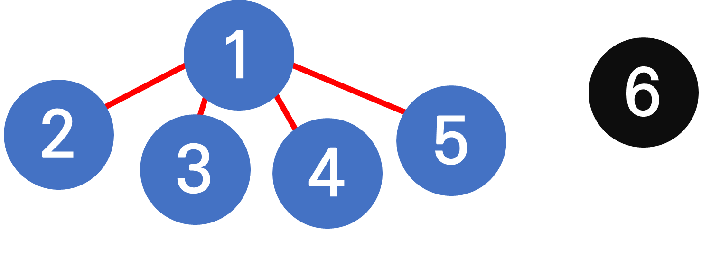
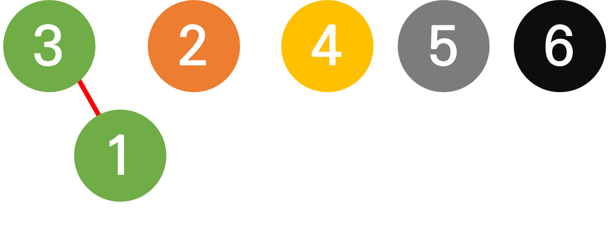

# Union Find

## Union Find (Disjoint Set)

### 정의 및 연산

- 서로소 집합이라고 한다. 서로소 집합이란, 서로 연결되어 있지 않은 합 집합의 집합이라고 할 수 있는데 이 **서로 연결되어 있지 않은 합집합**은 Tree의 모양으로 표현할 수 있고, Union Find는 Tree들의 집합이므로 Forest 형태의 자료 구조라고 할 수 있다.
- Union Find는 각 노드의 parent 를 나타내는 parent 배열을 통하여 구현할 수 있다.
- **연산**
  - `union(a, b)` : 서로소 집합을 합집합으로 만든다. a와 b를 같은 집합에 포함시키는 연산이다. (a와 b를 같은 Tree에 포함 시킨다) 이는 a와 b 중 한 노드의 parent 에 다른 한 노드를 연결시켜주는 방식으로 구현한다.
  - `find(a)` : 노드 a에가 속해있는 집합의 root (트리의 root)를 찾는다. 만약 root 가 노드 자기 자신이라면, 그 집합(트리)의 root 가 자기 자신이라는 의미이다.
    재귀를 통하여, 노드 a로 부터 parent를 타고 올라가는 방식으로 구현할 수 있으나, 부모의 값을 갱신함으로써 시간 복잡도를 최적화 할 수 있다.

### 구현

1. **`initialize`**


| i         | 1   | 2   | 3   | 4   | 5   | 6   |
| --------- | --- | --- | --- | --- | --- | --- |
| parent[i] | 1   | 2   | 3   | 4   | 5   | 6   |

모든 노드가 서로소인 상태이다. 즉, 모든 노드가 하나의 트리라고 할 수 있으며 모든 노드가 그 트리의 root인 상태이다.

- **코드 (JavaScript)**

```jsx
const idx = 7; // 인덱스를 6까지 사용하기 위함
const parents = Array.from({ length: idx }, (_, i) => i);
```

1. `find(a)`


위와 같은 disjoint-sets 이 있고 `find(5)` 의 값을 구한다고 생각해보자.

재귀를 이용하여 parent 를 타고 올라가면서 5의 root 를 구하면 된다.

- **코드 (JavaScript)**

```jsx
const find = (a) => {
  // root 인 경우
  if (parent[a] === a) return a;
  return find(parent[a]);
};
```

그러니 이 경우 시간 복잡도가 O(N)이 걸리게 되는데, find 연산을 통해 tree 를 타고 올라가면서 부모를 갱신해주는 방식을 사용하여 최적화 할 수 있다.

이 경우, 다음과 같이 구현한다.

- **코드 (JavaScript)**

```jsx
const find = (a) => {
  // root 인 경우
  if (parent[a] === a) return a;

  // find 의 정의가 a의 루트를 의미하므로, 
  // 아래의 코드는 노드 a를 a의 루트에 다이렉트로 붙인다는 의미이다.
  result = find(a);
  parent[a] = result;
  return result;
};
```

위의 연산을 통하여 `find(5)` 수행하면 다음과 같은 결과가 만들어진다.



| i         | 1   | 2   | 3   | 4   | 5   | 6   |
| --------- | --- | --- | --- | --- | --- | --- |
| parent[i] | 1   | 1   | 1   | 1   | 1   | 1   |

따라서 find 를 통하여 타고 올라간 노드들이 한 번에 root 와 연결되게 됨으로써 이 뒤의 find 연산은 더욱 빠르게 사용할 수 있다.

1. `union (a, b)`

예를 들어서 1번 node 와 3 번 node 를 합집합 한다고 하자.

1번 노드와 3번 노드 중 한 노드에 다른 노드를 이어주면 된다. (`parent[a] = b`)

즉, union (1, 3) 을 수행하고, 3번 노드의 parent 를 1번 노드에 연결한다고 하면 다음과 같은 상태가 만들어진다.



| i         | 1   | 2   | 3   | 4   | 5   | 6   |
| --------- | --- | --- | --- | --- | --- | --- |
| parent[i] | 3   | 2   | 3   | 4   | 5   | 6   |

- **코드 (JavaScript)**

```jsx
const union = (a, b) => {
  [parent_a, parent_b] = [find(a), find(b)];

  // 이미 같은 집합(tree)에 속해있음.
  if (parent_a == parent_b) {
    return;
  }

  parent[parent_a] = parent_b;
};
```

## 관련문제

[BOJ 1717 : 집합의 표현](https://www.acmicpc.net/problem/1717)

## 참고 자료

[유니온 파인드(Union-Find) (수정: 2020-08-03)
\[출처\] 유니온 파인드(Union-Find) (수정: 2020-08-03)|작성자 라이](https://blog.naver.com/PostView.naver?isHttpsRedirect=true&blogId=kks227&logNo=220791837179)
